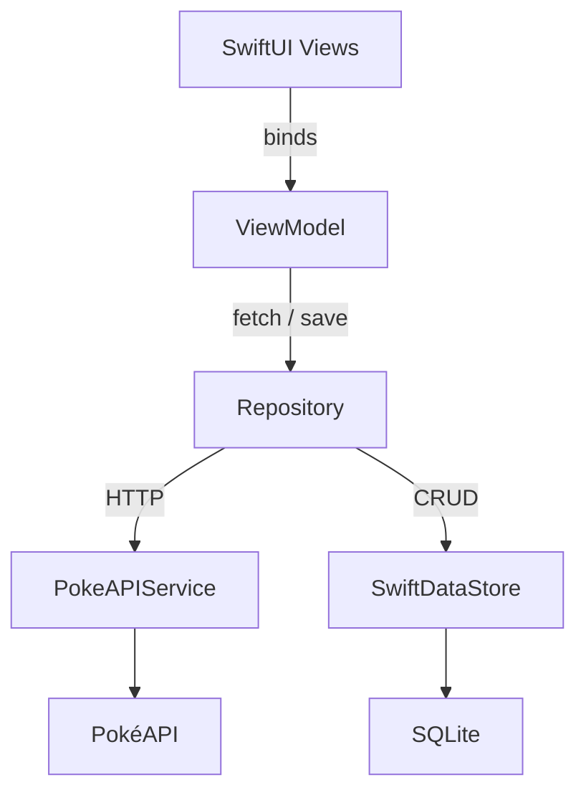

## 1. Equipe:
- Amanda Queiroz Sobral
- Carlos Eduardo Domingues Hobmeier
- João Vitor de Freitas
- Théo Nicoleli

## 2. Link do vídeo: 
Funcionamento completo do aplicativo no YouTube:  
[PokéExplorer](https://youtu.be/[https://www.youtube.com/watch?v=YTS854zc8ug)

## 3. Descrição do aplicativo:
O **PokéExplorer** é um aplicativo iOS (Swift + SwiftUI) que:

* Exibe uma lista paginada de Pokémon (20 por página) com scroll infinito.  
* Apresenta detalhes completos: sprite, tipos, habilidades, movimentos, altura e peso.  
* Permite ao usuário, após login, marcar Pokémon como favoritos e acessá‑los offline.  
* Oferece UI adaptativa (iPhone/iPad, retrato/paisagem) com animações suaves.


## 4. Escolha da API:

**API:** [PokéAPI](https://pokeapi.co/)

Utilizamos a PokéAPI porque é pública e gratuita, fornece dados abrangentes da franquia Pokémon e tem respostas JSON simples, facilitando o uso de `Codable`.

#### Como usamos a API

* `PokeAPIService` é um `Singleton` com **async/await** que expõe dois métodos principais:  

```swift
func fetchPage(offset: Int, limit: Int = 20) async throws -> [ListedPokemon]
func fetchDetail(id: Int) async throws -> PokemonDetail
```

* A lista principal chama `fetchPage` sempre que precisa de uma nova página.  
* A tela de detalhes chama `fetchDetail` apenas para o Pokémon selecionado, evitando tráfego desnecessário.

#### Endpoints e campos utilizados

| Endpoint | Uso | Campos |
|----------|-----|--------|
| /pokemon?limit=20&offset=n | Lista principal | `name`, `url` |
| /pokemon/{id} | Tela de detalhes | `sprites`, `types`, `abilities`, `moves`, `height`, `weight` |


## 5. Arquitetura do aplicativo (diagrama MVVM)



1. **View** liga‑se ao **ViewModel** via `@ObservedObject` e reflete qualquer mudança de estado.  
2. O **ViewModel** chama o **Repository** para obter ou gravar dados, mas nunca sabe de onde eles vêm.  
3. O **Repository** decide:  
   * se o dado está no **SwiftDataStore**, devolve imediatamente;  
   * se precisa de dados novos, faz uma chamada ao **PokeAPIService**.  
4. O **SwiftDataStore** persiste tudo em SQLite; consultas são reativas a partir de `@Query`.  


## 6. Implementação do SwiftData

#### Modelo de dados

```swift
@Model
final class Usuario {
    @Attribute(.unique) var id: UUID = .init()
    @Attribute(.unique) var email: String
    var username: String
    var senhaHash: String            // PBKDF2 + salt
}

@Model
final class Favorito {
    @Attribute(.unique) var id: Int  // Pokémon ID
    var ownerID: UUID                // FK → Usuario.id
    var name: String
    var url: String
}
```

#### Como os dados são salvos e buscados

* **Salvar**: `Context.insert()` seguido de `try context.save()` grava no SQLite.  
* **Buscar**: `@Query` em SwiftUI ou `FetchDescriptor` no repositório retornam entidades filtradas.  
* **Autenticação**:  
  1. No cadastro, geramos `senhaHash` com `CryptoKit` e salvamos o objeto `Usuario`.  
  2. No login, filtramos por `email` + `senhaHash`; se encontrado, gravamos o `UUID` no `UserDefaults` para manter sessão.  

Chamadas CRUD ficam encapsuladas em `AuthRepository` e `PokemonRepository`, mantendo a UI livre de lógica de banco.


## 7. Implementação dos Design Tokens:

```swift
enum ColorToken: String {
  case brandYellow = "#FFCB05"
  case brandBlue   = "#3B4CCA"
  case background  = "#FFFFFF"
  case textPrimary = "#1C1C1E"

  var color: Color { Color(hex: rawValue) }
}

enum FontToken {
  static let title = Font.system(size: 24, weight: .bold)
  static let body  = Font.system(size: 16)
}

enum SpacingToken: CGFloat {
  case xs = 4, sm = 8, md = 16, lg = 24
}
```

Os tokens foram declarados como `enum` para garantir *type‑safety* e autocomplete. Qualquer componente visual utiliza essas constantes — por exemplo, títulos usam `FontToken.title` e botões principais usam `ColorToken.brandBlue`. Dessa forma, mudar a identidade visual exige alterações em um único arquivo, propagando-se automaticamente pela base de código.

---

## 8. Implementação do item de criatividade

#### 8.1 Paginação infinita

```swift
@MainActor
final class PokemonListViewModel: ObservableObject {
    @Published var pokemons: [ListedPokemon] = []
    private var offset = 0
    private let limit  = 20
    private var loading = false

    func loadMoreIfNeeded(current item: ListedPokemon) async {
        guard item.id == pokemons.last?.id, !loading else { return }
        loading = true
        defer { loading = false }

        offset += limit
        let new = try await api.fetchPage(offset: offset, limit: limit)
        pokemons.append(contentsOf: new)
    }
}
```

#### 8.2 Cache de sprites

```swift
final class ImageCacheManager {
    static let shared = ImageCacheManager()
    private let cache = NSCache<NSString, UIImage>()
    private let folder = FileManager.default.urls(for: .cachesDirectory, in: .userDomainMask)[0]
                      .appendingPathComponent("PokemonImageCache")

    func image(for id: Int) async -> UIImage? {
        if let img = cache.object(forKey: "\(id)" as NSString) { return img }

        let fileURL = folder.appendingPathComponent("\(id).png")
        if let data = try? Data(contentsOf: fileURL), let img = UIImage(data: data) {
            cache.setObject(img, forKey: "\(id)" as NSString)
            return img
        }

        let url = URL(string:"https://raw.githubusercontent.com/PokeAPI/sprites/master/sprites/pokemon/\(id).png")!
        let (data, _) = try! await URLSession.shared.data(from: url)
        try? FileManager.default.createDirectory(at: folder, withIntermediateDirectories: true)
        try? data.write(to: fileURL)
        let img = UIImage(data: data)
        if let img { cache.setObject(img, forKey: "\(id)" as NSString) }
        return img
    }
}
```

---

## 9. Bibliotecas de terceiros utilizadas

| Biblioteca | Uso | Licença |
|------------|-----|---------|
| Kingfisher | Cache / download de sprites | MIT |
| SwiftGen   | Geração de enums para cores e assets | MIT |
| Quick / Nimble | DSL de testes unitários | Apache-2.0 |
| SwiftLint  | Lint de código | MIT |


